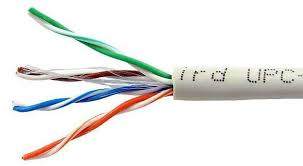
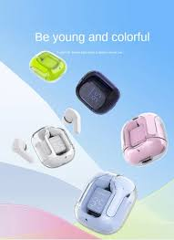

<html lang="id">
<head>
  <meta charset="UTF-8">
  <meta name="viewport" content="width=device-width, initial-scale=1.0">
  <title>TOKO RIMBERIO.SLAY</title>

</head>
<body>
   <header>
    

      
      

        <h2 style="margin:0;">TOKO RIMBERIO.SLAY</h2>
        
Menjual Kabel & Alat Jaringan dengan Harga Terjangkau

      

    

  </header>
  <nav>
    <a href="#home">Home</a>
    <a href="#produk">Produk</a>
    <a href="#tentang">Tentang</a>
    <a href="#kontak">Kontak</a>
  </nav>

    <h2>Selamat Datang di Toko RIMBERIO</h2>
    
Kami menyediakan berbagai kebutuhan jaringan seperti kabel UTP,
      konektor RJ-45, MIKRO USB, CASE HANDPHONE, kuliner dan lain-lain dengan harga bersaing.

  

  

    <h2>Daftar Produk</h2>
    

      

        
        <h3>Kabel UTP Cat 5e</h3>
        
Rp 3.000 / meter

        <button class="btn" onclick="addToCart('Kabel UTP Cat 5e', 'Rp 3.000 / meter')">Tambah ke Keranjang</button>
      

      

        
        <h3>Konektor RJ-45</h3>
        
Rp 2.000 / 3pcs

        <button class="btn" onclick="addToCart('Konektor RJ-45', 'Rp 2.000 / 3pcs')">Tambah ke Keranjang</button>
      

      

        
        <h3>MIKRO USB</h3>
        
Rp 10.000

        <button class="btn" onclick="addToCart('MIKRO USB', 'Rp 10.000')">Tambah ke Keranjang</button>
      

      

        
        <h3>CASE HANDPHONE</h3>
        
Rp 10.000

        <button class="btn" onclick="addToCart('CASE HANDPHONE', 'Rp 10.000')">Tambah ke Keranjang</button>
      

      

        
        <h3>CARGER HANDPHONE</h3>
        
Rp 20.000

        <button class="btn" onclick="addToCart('CARGER HANDPHONE', 'Rp 20.000')">Tambah ke Keranjang</button>
      

	  

        
        <h3>LAN ADAPTER USB</h3>
        
Rp 30.000

        <button class="btn" onclick="addToCart('LAN ADAPTER USB', 'Rp 30.000')">Tambah ke Keranjang</button>
      

	  

        
        <h3>HEADSET BLUETOOTH</h3>
        
Rp 27.000

        <button class="btn" onclick="addToCart('HEADSET BLUETOOTH', 'Rp 27.000')">Tambah ke Keranjang</button>
      

      

        
        <h3>HEADSET Kabel</h3>
        
Rp 15.000

        <button class="btn" onclick="addToCart('HEADSET Kabel', 'Rp 15.000')">Tambah ke Keranjang</button>
      

      

        
        <h3>TEMPERED GLASS</h3>
        
Rp 5.000

        <button class="btn" onclick="addToCart('TEMPERED GLASS', 'Rp 5.000')">Tambah ke Keranjang</button>
      

      

        
        <h3>DIMSUM_Rohma</h3>
        
Rp 1.000/biji

        <button class="btn" onclick="addToCart('DIMSUM DENONG', 'Rp 1.000')">Tambah ke Keranjang</button>
      

	  

        
        <h3>strowbery.Najwa</h3>
        
Rp 4.000/pack kecil

        <button class="btn" onclick="addToCart('strowbery.Najwa', 'Rp 4.000')">Tambah ke Keranjang</button>
      

	  

        
        <h3>cheese roll.Diana</h3>
        
Rp 1.000/BIJI

        <button class="btn" onclick="addToCart('cheese roll.Diana', 'Rp 1.000')">Tambah ke Keranjang</button>
      

	  

        
        <h3>Pangsit lumer.Rindu</h3>
        
Rp 2.000/pcs

        <button class="btn" onclick="addToCart('Pangsit lumer.Rindu', 'Rp 2.000')">Tambah ke Keranjang</button>
      

    

  

  

    <h3>Keranjang Belanja</h3>
    <ul id="cart-items"></ul>
    
Total: Rp 0

    

      <a href="#" id="checkout1" class="checkout">Checkout ke WA 1</a>
      <a href="#" id="checkout2" class="checkout">Checkout ke WA 2</a>
      <a href="#" id="checkout3" class="checkout">Checkout ke WA 3</a>
      <a href="#" id="checkout4" class="checkout">Checkout ke WA 4</a>
    

    <button class="btn" style="background:#e91e63; margin-top:10px; display:none;" id="clearCartBtn" onclick="clearCart()">Kosongkan Keranjang</button>
  

  
Produk berhasil ditambahkan ✅
 <!-- FIX emoji -->
  

    <h2>Tentang Kami</h2>
    
Toko RIMBERIO.SLAY adalah usaha kecil yang bergerak di bidang penjualan kabel, alat-alat GADGET dan alat-alat jaringan.
      Produk diambil langsung dari supplier online terpercaya dengan harga grosir, lalu dijual kembali
      dengan harga terjangkau. Kecuali (DIMSUM, Cheese roll, strowbery, dan Pangsit lumer) adalah produk kami sendiri.

  

   

    <h2>Kontak Kami</h2>
    
Hubungi kami melalui WhatsApp menggunakan tombol checkout di atas.

  

 
  
  <footer>
  
&copy; 2025 Toko RIMBERIO.NET - Semua Hak Dilindungi

  
Alamat: Jl. Nyimas Rara Kerta, Kec. Jamblang, Kab. Cirebon, SMKN 1 JAMBLANG, Kelas XI TJKT

  
WhatsApp: <a href="https://wa.me/6283152859084" style="color:white; text-decoration:underline;">+62 831-5285-9084</a>

</footer>
</body>
</html>
